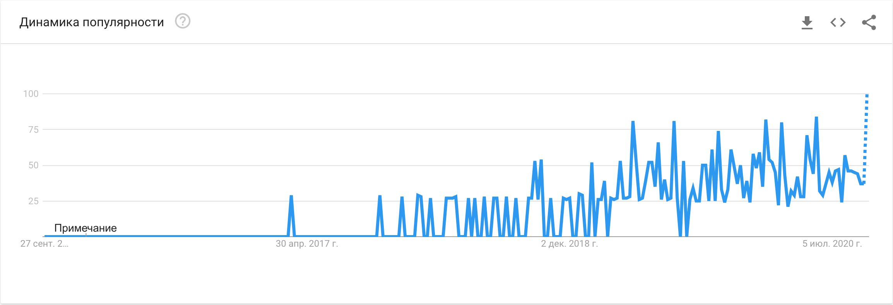
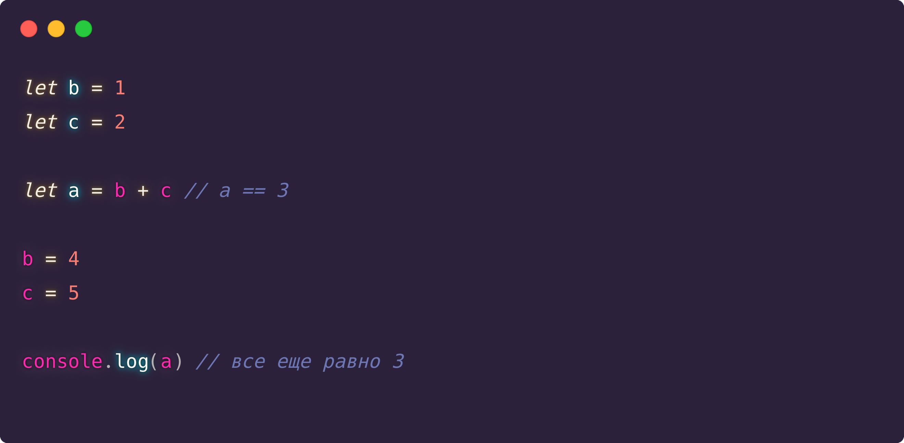
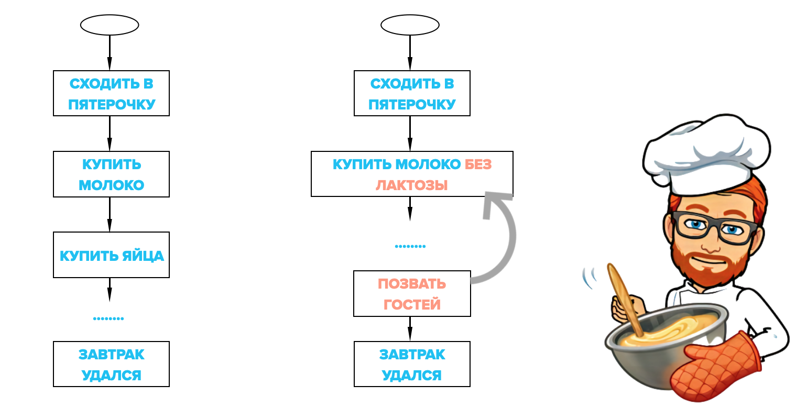
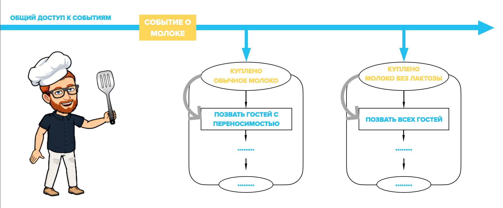
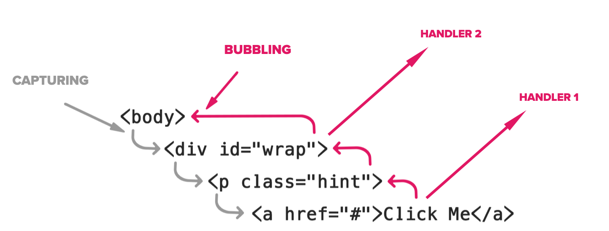

  

    
  

  

    Всем привет. Меня зовут Вадим. Я работаю lead разработчиком в компании EPAM. Мне нравится иногда делать доклады с использованием Svelte и размышлять на темы из области what if …?. Собственно, то, что вы сейчас читаете - это результат объединения двух моих увлечений.
  

  

    Почему стоит потратить время на прочтение?
    Конечно, в первую очередь - это то, что тема на слуху, стоит только бросить взгляд на гугл-трендс чтобы увидеть растущую популярность. А если посмотреть программу ближайшего HolyJs, то можно также несколько раз заметить знакомое слово.
  

   

  

  
    «Microfrontend» trends
    <a terget="_blank" href='https://trends.google.ru/trends/explore?date=today%205-y&q=microfrontend'>https://trends.google.ru/trends/explore?date=today%205-y&q=microfrontend
    </a>
  

   

  1. Следующий аргумент, нет ничего лучшего чем смотреть как кто-то набивает шишки. Эту информацию можно использовать в своей работе.
  2. `Svelte` теперь официально поддерживает `typescript` - мне кажется, самое больное место, которое тормозило использование фреймворка.
  3. `Реактивность`, `Микро-фронтенды`, “фреймворк только для виджетов”, на интуитивном уровне это все близко-близко друг к другу.
  4. В рунете достаточно материала по микро-фронтендам, но большинство, из которых я встречал либо описывают негативный опыт, либо описывают видение, которое отлично от моего. В этом докладе я бы хотел задать другое направление, через которое мы по-другому посмотрим на микро-фронтенды. Здесь нужно сделать оговорку, что `Svelte` как базовый инструмент выбран не совсем случайно, но он может быть заменен другим. Впрочем, обо все этом подробнее я расскажу дальше.
  5. И последнее, кроме всего прочего, я дитя поколения `миллениалов` и получаю такое же удовольствие от просмотра фильмов, как и от чтения художественной литературы. Поэтому сегодня предлагаю вам окунуться в мою историю. Я, конечно, не Нолан, но постарался следовать классическим канонам трехактной структуры. Поехали.

   

  # Акт I. Экспозиция
  

    Как водится, в любой классической истории необходимо присутствие протагониста. Таким протагонистом в этом докладе буду я сам. Но чтобы не ломать четвертую стену я буду называть себя “героем этого доклада” или просто “наш герой”.
  

  

    Так вот, наш герой и его работа ничем не отличается от обычной рутины программиста. Просыпается к дэйли, работает и отдыхает за компьютером, сидит до поздней ночи. Но как я уже сказал, однажды этот привычный лад заканчивается и зерно сомнения дает всходы. Наш герой узнает, что за холмами, люди помимо реакта, используют другие фреймворки, а иногда и вовсе не нуждаются в них. Но самое удивительное, что  редакс - это не единственный менеджер состояния. Наш герой загуглил mobx и оказывается он справляется со своей задачей на том же уровне, а иногда и лучше! Но вот, что странно - по всей документации красной нитью плетется слово реактивность.
  

   

  ## Реактивность.
  

    Наверно, самый простой способ объяснить, что такое реактивность не используя термины из программирования - это сравнить ее с эффектом бабочки. Взмах крыла бабочки в Европе приводит к торнадо в Америке. Между двумя этими событиями может быть сколь угодно промежуточных событий, но они есть и мы знаем, что торнадо - это следствие взмаха крыла. Это как натянутое полотно пожарников, и все кто его держит точно почувствуют когда на него упадет человек. Но вернёмся  к жизненным примерам.
  

  

    Самый частый пример, который можно увидеть в любой статье про реактивность - это работа в excel.
  

  

    Допустим у нас есть выражение типа A = B + C. Если у нас императивный подход, то в А попадет результат сложения  В и С, использующих значения на момент выполнения этой операции. Переменные В и С могут быть сто раз перезаписаны с новыми значениями, но это никак не повлияет на значение А.
  

   

  

  
    Императивный подход
  

   

  

    А теперь представим, что мы пишем код в excel. И у нас есть выражение типа А1 = B1 + C1. Два столбца и сумма двух ячеек в ячейке третьего. Теперь же, в любой из моментов, когда мы будем менять значения ячеек В1 или С1, значение ячейки А1 будет изменятся тоже. Этот процесс получил название - распространение изменений. А механизм, через который удается реализовать данный процесс, называют стримом, или потоком данных. Собственно отсюда и вытекают две главных составляющих реактивного программирования - реактивные ячейки и потоки данных.
  

   

  

  
    Реактивный подход
  

   

  ## Принципы реактивности

  

    Далее, если мы обратимся к принципам реактивного программирования, описанным в книге <a target="_blank" href="https://livebook.manning.com/book/functional-reactive-programming/chapter-1/1">“Реактивное программирование в действии”</a>, мы увидим:
  

  1. Реактивность - это реакция на изменение данных;
  2. Система, написанная в реактивном стиле, является событийно-ориентированной (event-based);
  3. Программа, написанная в реактивном стиле должна рассматриваться как поток данных (flow of data), а не как классический поток управления (flow of control)

  

    Все это позволяет нам ослабить связь между компонентами нашей программы/системы/приложения и писать модульный код. Это в прямом смысле означает, что классический подход к написанию кода больше не работает, нам более не важен порядок в каком будут написаны и вызваны наши инструкции. На первый взгляд выглядит как нелепица, но дайте мне объяснить все на примере.
  

  

    Допустим нам нужно приготовить омлет, у нас есть рецепт и список покупок. Если бы мы следовали императивному подходу, то нам следовало бы хорошенько продумать последовательность наших действий, сходить в пятерочку за углом, купить молоко, купить яйца, включить плиту, выставить температуру, разбить яйца в миску, перемешать, добавить молоко и так далее. Все будет прекрасно работать, но если у нас появяться новые условия или новые действия, например, мы хотим пригласить гостей, и знаем что, у кого-то непереносимость лактозы. То нам необходимо будет проделать некоторую дополнительную работу (добавить или удалить шаги), чтобы исходная инструкция осталась рабочей.
  

  

    Мы не справимся с задачей, весело провести завтрак, если мы будем использовать обычное молоко, а сами приглашаем гостей, которым необходимо безлактозное. Получается такая зависимость от инструкций, которые еще не случились.
  

   

  

  
     Готовим омлет по императивному
  

   

  

    Но если мы развернем зависимость в обратную сторону, то мы сможем ослабить связь между инструкциями и переиспользовать их как независимые модули.
  

  

    Что я имею в виду. Вместо того чтобы покупать молоко для специальных гостей, мы приглашаем гостей, основываясь на купленном молоке. Таким образом наш исходный алгоритм не разбивается на более мелкие шаги, а наоборот собирается из таких мелких модулей.
  

  

    Еще проще. У нас есть два независимых модуля, которые выполняют функцию приглашения гостей. Один зовет гостей с переносимостью лактозы, другой без, возможно там что-то еще, не суть сейчас. Оба они подписаны на событие о том какое молоко куплено. И как только такое событие происходит, срабатывает соответствующий модуль. Эти модули ничего не знают про общую цель, они лишь выполняют свою функцию в рамках событий, на которые подписаны.
  

   

  

  
     Готовим омлет по реактивному
  

   

  ## Бенефиты реактивности

  

    Какие бенефиты это несет:
  

  1. Во-первых, как уже много раз было сказано - модульность и независимость друг от друга, что повышает переиспользуемость данных модулей.
  2. Декларативность, мы больше не говорим “как” сделать, мы говорим “что”. Упаковываем инструкции в модуль и называем привычным нам языком.

   

  

    Предвкушаю ваш следующий вопрос...
  

   

  

   

  

    Поэтому пришло время срывать маски. Все это время под маской реактивного программирования был обычный observer pattern. Даже если вы не поверили мне и пойдете сами изобретать реактивное программирование на javascript, вы скорее всего изобретаете observer pattern.
  

  

    Даже если это будет не классический observer pattern, это все равно будет некоторым подобием событийно-ориентированной архитектуры, о чем мы поговорим чуть далее.
  

   

  

  ---

  

    Здесь следует провести черту и рассказать в чем между ними отличия, хотя оба термина (событийно-ориентированная архитектура и observer pattern) все еще находятся в поле реактивного программирования и оба удовлетворяют принципу распространения изменения.
  

  

    Event-driven architecture - такой шаблон организации независимых модулей, при котором механизму, который генерирует события в общем-то все равно, кто эти события будет слушать. Это как broadcast, событие попадает в какой-то общий канал и все его участники это событие могут обработать, асинхронно. Зачастую такие события практически обезличены и не несут какой-либо специфичной информации, возможно только метаданные самого события.
  

  

    Отличным примером такого подхода могут служить DOM события. По большому счету браузеру все равно, какой фреймворк сейчас обрабатывает события, а тем более кто там подписался на клик на бади.
  

   

  

   

  

    Второй подход заключается в использовании observer pattern. Ключевое отличие от EDA состоит в том, что элемент, который генерирует событие, заставляет всех своих подписчиков обработать это событие в синхронном режиме.
  

  

    Жонглируя этими подходами, расширяя и сужая возможности, можно реализовать действительно хороший инструмент распространения изменений в вашем javascript приложении. Я оставлю несколько ссылок на статьи где описываются хорошие реактивные системы в существующих инструментах и фреймворках, таких как <a target="_blank" href="https://blog.logrocket.com/truly-reactive-programming-with-svelte-3-0-321b49b75969/#:~:text=Svelte%203.0%20moves%20reactivity%20out,API%20and%20into%20the%20language.&text=setState%20in%20React%20%28and%20most,completely%20unaware%20of%20data%20changes.">Svelte</a>, <a target="_blank" href="https://antfu.me/posts/watch-with-reactivity/">Vue</a>, <a target="_blank" href="https://www.pzuraq.com/what-makes-a-good-reactive-system/">Ember, RxJs, Elm</a>.
  

  ---

  

    Итак, разобрались. Реактивность - неплохой взгляд на то, как можно писать код. Но нет ли у вас ощущения, что все равно, что-то не так?
  

  

    Потому что, если все хорошо, мы бы взяли наш отлаженный рабочий реактивный фреймворк и работали бы в свое удовольствие. Но нет, мы каждое утро заходим в твиттер и видим как кто-то постит, что нашел сильно пахнущий кусок кода в своем проекте. Читаем новые книжки про архитектуру. Собираемся на конференциях и пытаемся научится чему-то. Зачем, если есть такая вещь как реактивность? Зачем нам что-то другое?
  

  

    Что же, в каждой статье на медиуме присутствует раздел про минусы, такой раздел есть и у реактивности. Это управление сложностью. Как только ваш проект разрастается, зачастую, если разработчики пропустили этот момент, вся реактивщина превращается в тыкву. Поскольку реактивные системы - это, по большей части, модульные системы, связность таких модулей становится очень тесной. Весь проект начинает выглядеть как таиландские провода. Становится непонятно, откуда и куда идут сообщения, что триггерит что. Продолжать разработку, тестирование и прочие активности становится ужасно больно.
  

   

  

   

  

    Дойдя до этого этапа, наш герой, казалось, разочаровался в жизни. Зачем давать такую сладкую надежду, чтобы тут же облить ее керосином и поджечь, мир не может быть настолько жестоким. Но первый акт подходит к концу, поэтому на горизонте маячит переломный момент. Наш герой находит “рояль в кустах”. Книга! Заповеди программирования (не является настоящей книгой)! Наш герой судорожно листает страницы и повторяет, - “ответы, мне нужны ответы!”, глаза останавливаются на строчке, герой читает - “Пишите код так, как будто сопровождать его будет склонный к насилию психопат, который … ”, - “Это все не то!”, - кричит герой. И дойдя до последней страницы, наш герой замечает, как кто-то карандашом, еле-еле видно, нарисовал на обложке несколько символов. Он приглядывается и видит странную надпись.
  

  

    💩💩💩&nbsp;лучше чем &nbsp;💩
  

  

    На лице у него сияет улыбка и он отправляется в свое новое путешествие, из которого он уже не сможет вернуться прежним.
  

