

  

   

  # Акт II. Из двух зол ...

  

    Итак, с маленькой кодовой базой намного легче работать чем с большой. Надеюсь всем удалось разгадать мой ребус.
  

  

    А что в свою очередь выглядит как множество независимых модулей. Правильно, микро-фронтенды. Давайте о них и поговорим.
  

  

    Небольшое отступление. Все о чем я далее буду рассказывать базируется в основном на двух священных писаниях по микро-фронтендам. Это книга <a target="_blank" href="https://livebook.manning.com/book/micro-frontends-in-action/chapter-1/v-4/1">“микро-фронтенды в действии”</a> от Майкла Гирса и <a target="_blank" href="https://martinfowler.com/articles/micro-frontends.html">лонгрид на martinfowler</a>. Поэтому если после доклада появится желание побольше преисполнится в этой теме, то вы будете знать где искать.
  

   

  ## Фантастические микро-фронтенды и места их обитания.

  

    Итак, что мы знаем про микро-фронтенды? “Чтобы понять, что такое микро-фронтенды, надо думать как микро-фронтенды” - скажете вы. А что, если я скажу вам, что вы уже работали с микро-фронтендами. Ведь микро-фронтенды - это НЕ новая технология, это альтернативный способ организовать вашу повседневную работу. Микро-фронтенды - это то, что у вас получается, когда вы находитесь в промежуточном этапе миграции одного фреймворка на другой, одной версии на другую, когда вы переводите свое javascript приложение на typescript.
  

  

    В этом высказывании есть зерно правды, но все-таки оно остается не очень точным, поэтому я предлагаю вам, представить микро-фронтенды в виде пиццы. Да, после моего монолога, захочется покушать. Кусочек за кусочком мы будем отрывать новую информацию, пока не утолим наш голод познания.
  

  

    Поэтому давайте оторвем первый кусок и узнаем что в принципе нам могут предложить микро-фронтенды и какие проблемы они решают.
  

   

  ## Show me whatchugot!

  

    Самое главное изменение, которое предлагают микро-фронтенды - это отказ от горизонтального планирования команд в пользу вертикального. Что это значит? - Спорю, что здесь у многих уже есть опыт работы в подобных командах. Это так называемые кросс-функциональные команды, когда команды состоят из специалистов, которые единолично могут выводить новые фичи в продакшен, начиная от планирования идеи и дизайна заканчивая полированием производительности sql запросов.
  

   

  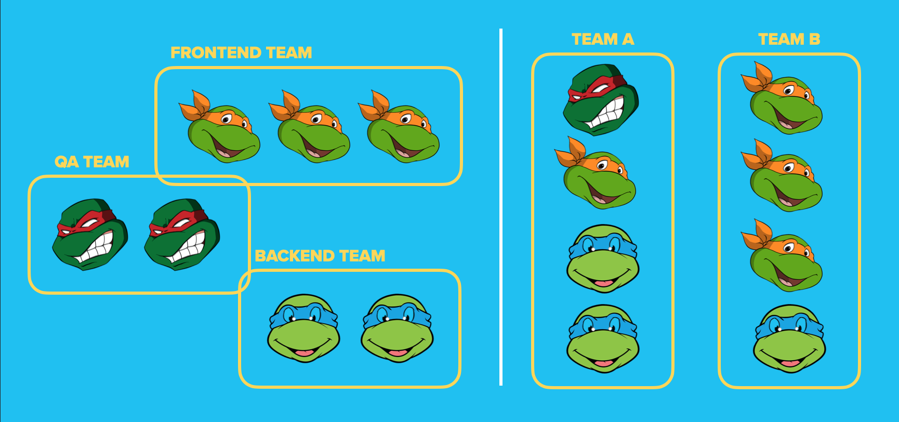

  
    Горизонтальные команды заменяются вертикальными
  

   

  

    Здесь может возникнуть резонный вопрос, чем это вертикальное планирование лучше? Если фронтендеры работают бок о бок с фронтендерами, бэкендеры с бэкендерами. Они могут помогать друг другу, обсуждать баги и делать наилучшее решение, которое только смогут сделать. И если на каждом слое мы получим наилучшее решение, не сделает ли это только лучше для всего приложения? Это заявление не всегда так работает в жизни. Как показывает практика, если фронтендеры работают бок о бок с бэкендерами и с ребятами из бизнеса это позволяет увидеть проблему продукта с разных сторон и прийти к самому эффективному и креативному решению. Возможно оно будет не самое лучшее с технической точки зрения, но зато оно будет соотносится с миссией команды.
  

   

  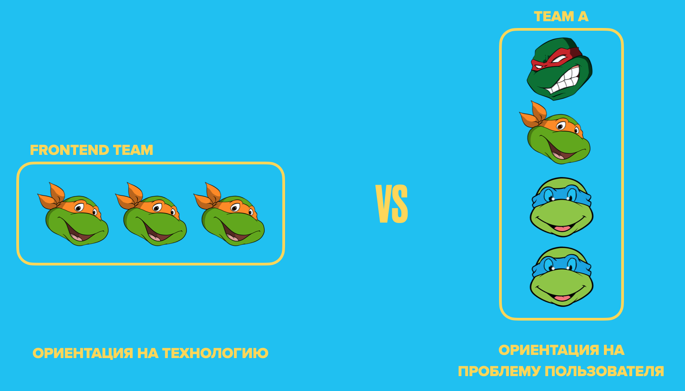

   

  

    Это позволяет всем членам команды принимать участие в его создании и фокусироваться на конкретном опыте пользователя, что невозможно при горизонтальном планировании. В этом случае очень трудно идентифицировать себя с продуктом, поскольку все требования приходят сверху и не требуют концентрации, чего не происходит при вертикальном планировании.
  

   

  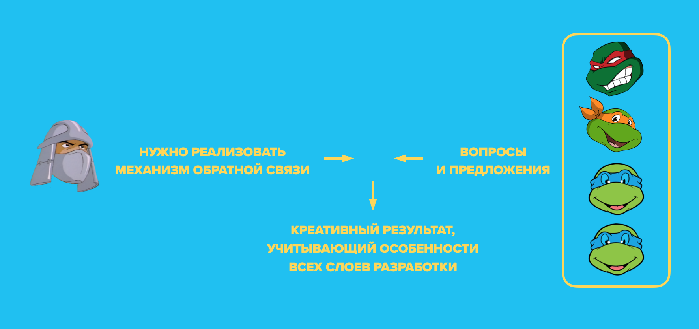

  
    Работа с требованиями при вертикальном планировании
  

   

  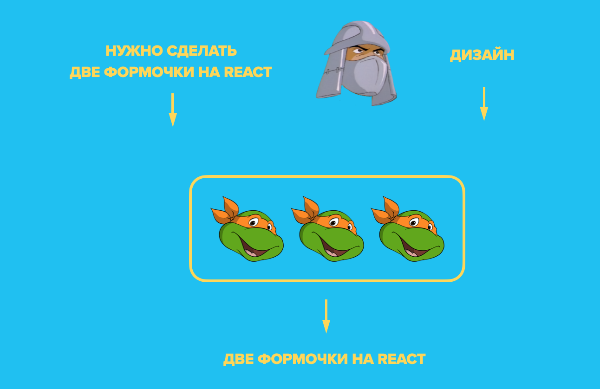

  
    Работа с требованиями при горизонтальном планировании
  

   

  

    На этом моменте мы уже можем увидеть следующие бенефиты использования микро-фронтендов:
  

  1. быстрая и независимая доставка новых фич в прод, когда у тебя небольшая ангажированная кросс-функциональная команда, тебе намного легче принимать решения, поскольку в команде уже есть все необходимые компетенции. Тебе больше не нужно создавать митинг на 20 человек, чтобы обсудить название переменных;
  2. фокус на проблеме пользователя, команды разрабатывают фичи непосредственно для конечного потребителя. У команды появляется миссия;
  3. использование технологий, которые делают счастливыми самих разработчиков, больше никаких “так исторически сложилось”; Кроме того, поскольку кодовая база микро-фронтенда настолько мала, ее бесконечно (в теории) можно переписывать, придавая ей более элегантный вид.
  4. предсказуемое поведение микро-фронтендов, поскольку все фичи команды конкретны и упакованы в своеобразный контейнер, поиск ошибок становится простым и сводится к небольшому участку кодовой базы.

   

  

    Сейчас прямо чувствую, по ту сторону экрана как вы такие, - “wait a minute, то есть микро-фронтенды заставляют нас менять структуру команд, запрещают нам коммуницировать между командами, потому что это очень дорого по времени и  клиенты не ждут, им нужны новые фичи. Но ничего нам не говорят про то, что теперь нам нужно писать ещё больше кода, так как в каждой команде и в каждом микро-фронтенде есть общие куски кода, общие компоненты, а горизонтально мы их не можем переиспользовать, потому что это опять трата времени. И вообще, что делать со стилями?”
  

  

    Это очень правильный вопрос, и уверен, если вы решитесь связаться с микро-фронтендами, то будете задавать его очень часто.
  

  

    Конечно же, здесь тоже нет серебрянной пули и отрывая следующий кусочек от нашей пиццы (переиспользование общих ресурсов), мы осознанно делаем эту концепцию, в каком-то роде, противоречивой.
  

  

    Никто не считает создание общей библиотеки компонентов чем-то плохим, это всегда помогает увеличивать скорость разработки и не писать тонны повторяющихся компонентов. Но всегда существует очень много моментов из-за которых все может пойти не так. Обычно - это создание такой библиотеки с большим количеством компонентов на очень раннем этапе. Поскольку апи для таких компонентов будет сыро на протяжении некоторого времени, это будет приводить к тому, от чего нас пытаются уберечь микро-фронтенды, коммуникации среди команд и огромная трата времени, потому что когда люди разговаривают, они не работают.
  

  

    К той же трате времени можно отнести вопрос - “Кто будет следить за такой библиотекой?”. Очень часто можно получить ответ, что все команды будут и должны мониторить изменения, но если переводить с разработческого языка, то это значит никому это не будет нужно. А выделять дополнительную команду или человека - это серьезное решение.
  

  

    Также, очень часто бывает, что в такие расшаренные библиотеки попадают компоненты, которые явно завязаны на какую-то часть бизнес логики, какая-нибудь user-table. Но это не правильно, даже если мы не используем микро-фронтенды. Поэтому единственными кандидатами на выселение в расшаренные библиотеки становятся такие примитивные вещи как иконки, инпуты и кнопки. И уже решение о выделении доп команды для такой библиотеки становится еще абсурдней.
  

  

    “Но а как же стилизация, кастомизация и вот это вот все?” - спросите вы, а я в ответ покажу отличный <a target="_blank" href="https://youtu.be/A3CamtT9VBs">доклад с прошлого холи</a>, про быструю доставку дизайна в код.
  

  

    Ребята рассказывают, как можно сделать из вашего дизайна переиспользуемый ресурс. Когда все базовые примитивы, такие как   цвета, размеры или отступы, лежат в одном месте (в фигме) и их очень легко применить на ваш боевой код. Таким образом легко решается проблема коммуникаций, поскольку их просто не будет, дизайнеры будут разговаривать, а разработчикам остается только договорится о том, как этот дизайн будет применяться на их приложения.
  

  

    Все что нужно сделать - это корректное использование css и валидный html. Семантические теги и соглашение по именованию классов ну или нечто, что позволит изолировать классы для отдельных компонентов, благо таких инструментов огромное кол-во, от css модулей и css-in-js до shadow-dom.
  

  

    Вижу ваше немое возмущение, - “Эммм, я не хочу писать 23 раза
  

   

  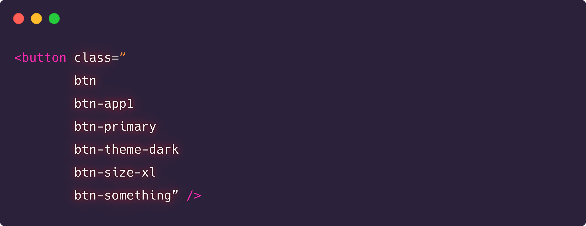

  

    я хочу писать
  

  

  

    Поэтому мы возвращаемся в начало и именно поэтому мы до конца не можем снять противоречие в переиспользовании общих ресурсов.
  

  

    Ладно, давайте пока это оставим и перейдем к самому интересному, что есть в микро-фронтендах. То как их нужно собирать вместе и как они должны при этом общаться.
  

  ## Micro Frontends assemble!

  

   

  ### Build-time solutions

  

    Итак, поразмыслив над концептами, которые предлагают нам микро-фронтенды, давайте перейдем непосредственно к самим микро-фронтендам.
  

  

    И рассказывая про первый способ организации микро-фронтендов, я бы представил, как пользователь заказывает пиццу у официанта. Он говорит /пицца и официант дает слайс пепперони, пользователь говорит /бургер и официант дает бургер. Как вы догадались этим официантом может быть nginx или любой другой инструмент, который поможет загружать отдельные микро-фронтенды полагаясь на location и path который получает.
  

  

    На мой взгляд, сейчас - это самый популярный способ разбить большое приложение на отдельные модули и раздать их отдельным командам. Но единственное, что здесь не так - это перезагрузка страницы каждый раз при смене урла.
  

  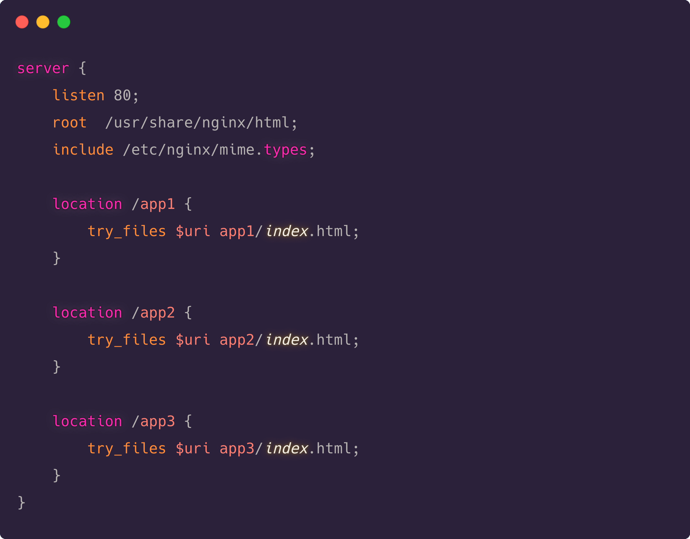

   

  

    Небольшое улучшение в этот способ может привнести ssi, или серверные вставки. Немного изменив конфигурацию мы сможем переиспользовать элементы, которые не требуют частых изменений, футеры, хедеры и вот это вот все.
  

  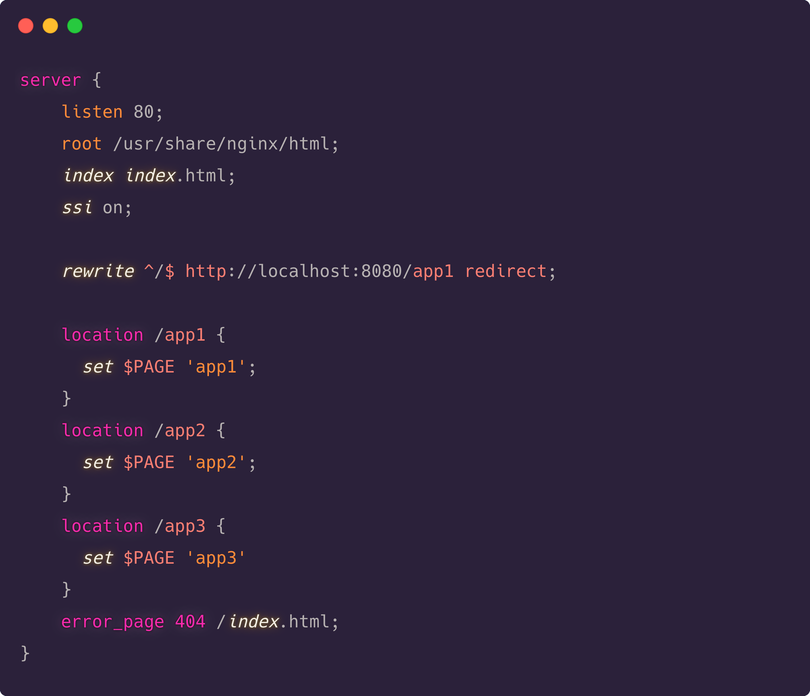

  

   

  

    Ведь что такое веб-приложение? В первую очередь это верстка, некоторый кусочек html разметки. А микро-фронтенды - это другие кусочки которые мы вставляем в нужном порядке в наш исходный кусок. Если мы вернемся к использованию первого варианта, с загрузкой полного приложения на новый урл, это снова откинет нас к нашей проблеме, обсуждения того, что должно быть одинаковым в разных приложениях. Поэтому, если уж мы и говорим про микро-фронтенды, то имеет смысл всегда иметь некоторый контейнер, который мы наполняем нашими модулями и всем, что в них одинаково.
  

  

    Этот контейнер принято называть host-приложением, для него выделяется отдельная команда, и обычно это приложение решает больше инфраструктурные вещи, роутинг, аутентификацию и прочее. Поэтому далее в примерах мы будем иметь в виду, что наши микро-фронтенды собираются как раз таки в такой host.
  

  ................................

  

    Идем дальше. И следующий способ организации микро-фронтендов, наверно, мог бы возникнуть если бы мы спросили об этом фронтенд разработчика образца 2015 года.
  

  

    Поскольку вся кодовая база отдельного микро-фронтенда должна быть изолирована от других частей и нам достаточно только знать точку в которую мы собираемся монтировать наш микро-фронтенд, то почему бы не завернуть весь модуль в отдельный пакет и собирать все приложение как-будто из отдельных компонентов.
  

  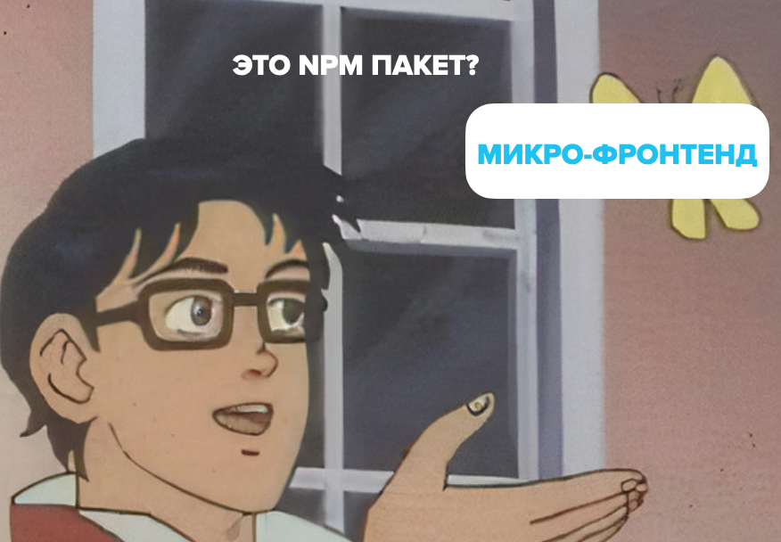

   

  

    В таком случае мы получаем настоящую изоляцию, разработка все еще остается параллельной, и мы можем с легкостью переиспользовать зависимости, которые могут быть у нескольких микро-фронтендов.
  

  

    На мой взгляд, это и смутило Дена Абрамова в микро-фронтендах и сподвигло его на <a target="_blank" href="https://twitter.com/dan_abramov/status/1132493678730252288">данный твит</a>.
  

  

    Очевидно же, зачем нам отдельные приложения в отдельных пакетах, когда можно хорошо продумать компонентную составляющую всего приложения, вынести общие части и радоваться? Но только микро-фронтенды - это не только про то как их вместе организовать, это еще про скорость и фокус.
  

  

    Никакого смысла в пакетах нет, так как это все равно блочит команду от быстрых релизов, поскольку на каждый апдейт версии отдельного пакета, нужно обновлять host приложение, а это опять потеря времени.
  

  

    Кроме того, компоненты вынесенные в отдельные пакеты, никакой бизнес задачи не решают - это все инфраструктурные вещи, которые облегчают жизнь разработчикам. Но если же мы говорим про микро-фронтенды, то это прямо таки конкретный инструмент бизнеса, мы держим фокус на конкретной проблеме и моментально реагируем на малейшие изменения. Поэтому данный подход не совсем подходит к тому, о чем мы пытаемся рассуждать здесь.
  

   

  ### Run-time solutions

  

    Итак, предыдущие способы организации были направлены, в основном, на работу на сервере либо во время сборки (build-time integration) всего приложения. Пришло время обсудить решения для run-time.
  

  

    Первым и самым популярным кандидатом, наверно, становится iframes.
  

  

    Слышу шепот по ту сторону экрана, - “Он что, сказал iframes?”. Да. Если мы вспомним, о чем говорили в начале второго акта, про то, что нам предлагают микро-фронтенды, (изоляция, быстрая разработка и тд) то iframes спокойно вписываются в эту концепцию. Но почему же в веб-разработке принято не любить iframes?
  

  

    Что же, тут есть несколько причин, из-за которых придется поломать голову.
  

  1. Когда мы говорим про изоляцию, то имеем в виду прям изоляцию-изоляцию, что делает этот подход менее гибким.
  2. Существуют также особенности в коммуникации между host приложением и iframes, можно же, конечно, использовать postMessage protocol, но поскольку iframes - это буквально браузер в браузере, это накладывает определенные трудности, особенно, когда таких браузеров несколько на странице.
  3. Контролировать состояние url iframes тоже проблематично, поскольку оно никак не будет представлено в url самой страницы. И у нас просто так не получится делиться ссылками и надеятся, что мы будем получать ту же самую страницу каждый раз.

  

    Эти проблемы, конечно, не самые сложные, но заставляют лишний раз подумать, нужно ли их решать. (life is too short to use iframes).
  

  ................................

  

    Следующий способ, который я бы хотел осветить, предельно похож на предыдущий. Вместо iframes можно использовать web-components они же кастомные элементы. Каждый ваш микро-фронтенд прячется под кастомным тегом. Его можно разместить в любом месте вашего приложения, а чтобы кастомный тег работал, достаточно просто подключить скрипт с его определением, что можно сделать в ленивом стиле.
  

  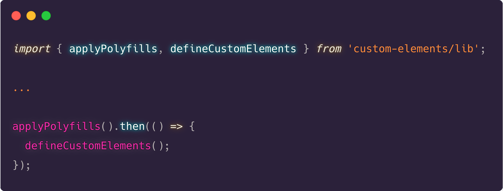

   

  

    Я уже упоминал, что микро-фронтенды - это то что получается у нас в моменте миграции и веб-компоненты как промежуточное звено, очень хорошо себя здесь чувствуют. Для более подробной информации можно ознакомится с <a target="_blank" href="https://youtu.be/CaP5eAylYpI">докладом Дениса Мишунова</a> или с <a target="_blank" href="https://youtu.be/FBk5j62O4f0">одним из моих</a> предыдущих докладов, где я показывал как можно мигрировать с реакта на свелт.
  

  

   

  

    Если мы используем веб-компоненты, то мы сразу избавляемся от проблем роутинга и коммуникации. Поскольку веб-компоненты это просто js файл, мы его подключаем как отдельный скрипт на страницу, что нисколько не блочит релизный цикл каждого отдельного микро-фронтенда, достаточно просто загружать каждый раз последнюю версию этого самого веб-компонента. И host приложение будет up to date. Также, как только веб-компонент загрузится он станет частью страницы, которую мы просматриваем, все данные которые доступны этой странице с легкостью можно передать веб-компоненту в обычном стиле через атрибуты тега. Таким образом мы никогда не потеряем состояние, если захотим расшарить ссылку.
  

  

    Но всегда есть но. АПИ для веб компонентов все еще вызывает вопросы, и множество проблем, которые уже решены при помощи других инструментов, все еще присущи веб-компонентам. Поэтому однозначного ответа в отношении этой технологии еще нет, право выбора все еще лежит на плечах разработчика.
  

  ................................

  

    Последний способ, который я хотел бы рассмотреть - это композиция микро-фронтендов в рантайме при помощи обычного js. Этот способ предельно похож на предыдущий, но только нам не нужно инкапсулировать всю логику внутри веб-компонента и использовать дополнительные технологии, чтобы не плодить баги.
  

  

    Опять же, в основе лежит тот факт, что любое веб приложение это всего лишь верстка, кусок верстки, и чтобы использовать микро-фронтенды нам нужно загрузить ещё один кусок верстки. С этим прекрасно справляются современные фреймворки. Все что нам нужно сбилдить наше приложение на реакте, ангуляре, вью в два файлика js, css и все. Заранее на странице мы расставляем теги со специальными айдишниками, и добавляем тег скрипт с ссылкой на наш js. После того как скрипт загрузится, фреймворк найдет свой айдишник и инициализирует микро-фронтенд.
  

  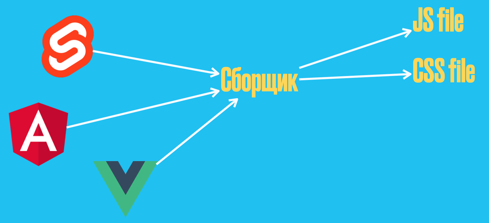

  

   

  

    Среди перечисленных выше способов композиции микро-фронтендов нет однозначно плохих, но, вероятно, последний наиболее удобный в работе с ними. Поскольку мы работаем с нативным js, мы сами вольны вносить или не вносить сложности и абстракции. Мы сохраняем способность быстро и независимо деплоить новые изменения не затрагивая хост. А поскольку мы все еще остаемся в едином контексте, чего нет в iframes или web-components, мы облегчаем себе работы по коммуникации среди всех микро-фронтендов.
  

  ................................

  

    Итак, что мы уже узнали к этому моменту?
  

  1. Что микро-фронтенды это не про технологии, это про организацию работы.
  2. Микро-фронтенды нацелены на быструю разработку и бесконечное улучшение текущей кодовой базы каждого отдельного микро-фронтенда.
  3. Самый гибкий способ работы с микро-фронтендами - это использовать обычный js, для загрузки модулей в рантайме и монтирования их в хост приложение.

   

  

    Единственное чеховское ружьё, которое еще не выстрелило - это реактивность, с которой мы познакомились в первом акте, и единственная тема которую нам надо рассмотреть - это коммуникации среди микро-фронтендов. Давайте убьем двух зайцев одним выстрелом.
  

   

  ## Позови меня тихо по ивенту

  

    Есть такая пословица (или нет): “Прежде чем что-то сказать, лучше трижды подумать”. Это относится и к коммуникациям микро-фронтендов. Почему так?
  

  

    Как ни странно, коммуникации - это тоже переиспользуемый ресурс, а значит что? Правильно, мы блочим сами себя, вводя любые способы общения. Чем больше каналов, тем больше мест, где что-то пойдет не так и придется совместно решать, как это исправить. Поэтому, по возможности, стоит избегать любого общения между микро-фронтендами.
  

  

    Если же происходит иначе, от спринта к спринту вы замечаете, что общение между двумя микро-фронтендами только увеличивается, то значит пришло время пересмотреть границы ответственности двух команд, отвечающих за эти микро-фронтенды.
  

  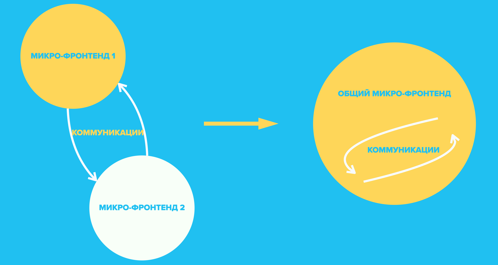

   

  

    Далее, если мы все-таки допускаем, что наши микро-фронтенды каким-то образом коммуницируют, то что они должны пересылать друг-другу? На мой взгляд - это должны быть только нотификации или события о чем-то. Как если бы это были обычные события DOM.
  

  

    Это создает образ более естественной коммуникации. Большой payload события вызывает вопросы:
  

  1. Как это типизировать и держать в актуальном состоянии?
  2. Почему тогда не использовать бэкенд для этих целей, если такой большой кусок данных, должен быть расшарен между разными областями ответственности? Но здесь наверно нужно послушать доклады Андрея Мелихова про BFF, чтобы ориентироваться, что где должно быть.

   

  

    Идем далее. Теперь нам нужно установить, каким может быть общение в принципе. Мы можем коммуницировать в следующих направлениях:
  

  - Хост -> микро-фронтенд (прямая вставка)
  - Хост -> микро-фронтенд микро-фронтенда
  - Микро-фронтенд -> Хост (обратная связь)
  - Микро-фронтенд микро-фронтенда -> Хост
  - Микро-фронтенд -> Микро-фронтенд (плоское взаимодействие)

  

    А еще мы можем выбросить этот список и больше не вспоминать как страшный сон. Поскольку у нас изолированные микро-фронтенды, общение возможно построить только на событиях и все микро-фронтенды будут находится в плоской структуре, поэтому актуальный способ организации взаимодействия микро-фронтенд -> микро-фронтенд.
  

  

   

  ### Custom Events

  

    Итак, первый кандидат на звание - инструмент коммуникации микро-фронтендов - custom events. Довольно легко было догадаться.
  

  

    Что могут нам предложить кастомные события. Очень много на самом деле. Как и обычные события они имеют название и некоторую мета-информацию, кроме всего прочего, мы сами можем наполнять payload или detail таких событий.
  

  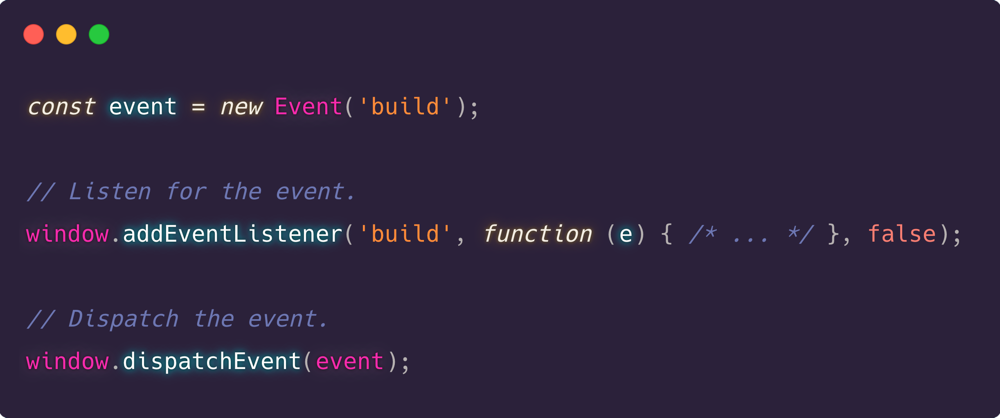

  

   

  

    По умолчанию, кастомные события не всплывают до window. Поэтому это может вызвать некоторые трудности. Всегда нужно будет использовать сам window как глобальную базу для всех событий. Зарегистрировать и вызвать ивент в одном микро-фронтенде, поймать в другом. Это будет работать, но мы можем включить всплытие и тогда в метаинформацию события также попадет таргет. Элемент на котором произошло событие, если, конечно, нужна некоторая дополнительная информация для дебага. Помимо прочего, такое событие можно будет остановить по пути наверх.
  

  

    Поддерживаются кастомные события во всех браузерах, за исключением IE, хотя там тоже можно сделать хак.
  

   

  ### Broadcast Channel API

  

    Следующий кандидат, который доступен из коробки почти во всех браузерах, бродкаст ченел. Данное апи позволяет осуществлять базовую коммуникацию между окнами, табами, iframes и воркерами, указанным в названии способом.
  

  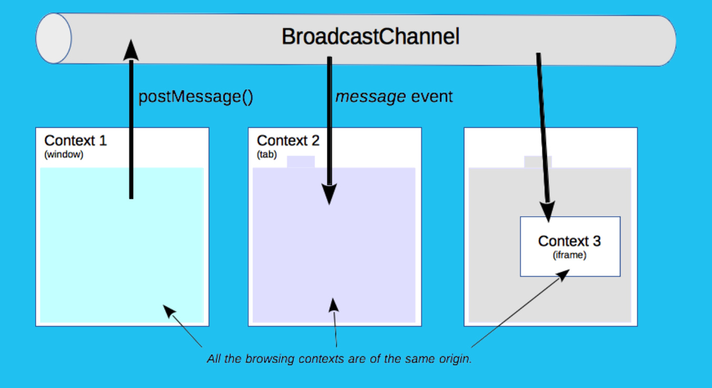

   

  

    Что мы можем сделать? Создать канал с определенным именем. Подписаться на данный канал при помощи onmessage. Послать сообщение через postMessage в канал, и все, кто был подписан получат данное сообщение. Можно посылать сериализованные объекты, кроме DOMString. Хотя это и облегчает работу с некоторым payload, наверно это может вызвать некоторые трудности с типизацией.
  

  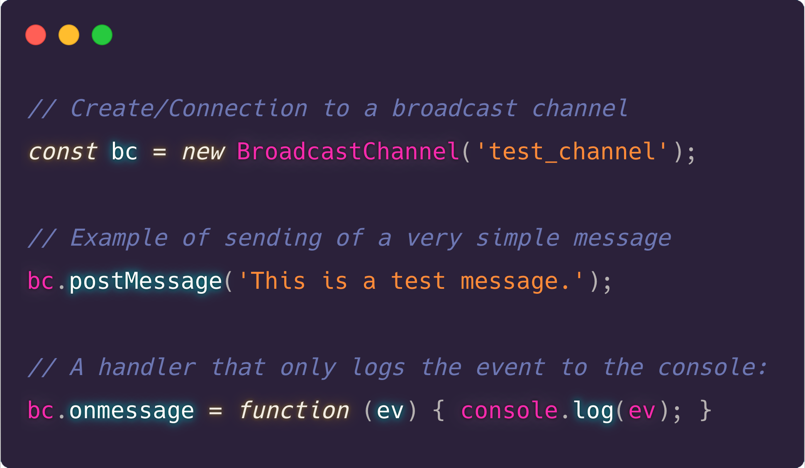

   

  

    Стоит иметь в виду, поскольку мы говорим про события в рантайме фронтенда, как я уже упоминал, может быть такая ситуация, когда ваш микро-фронтенд еще не готов, чтобы слушать или отправлять события. Поэтому если считаете, что это ваш кейс, то, наверно, в качестве шины событий лучше использовать какой-нибудь общий сервис на бэкенде.
  

  

    Заканчиваю мое последнее предложение и уже слышу как вы яростно бьете по клавишам ваших ноутбуков, “Как так, какие события? А если мне надо шарить состояние? Ну надо!”. Тогда я обязан познакомить вас с докладом Паши Малышева, про <a target="_blank" href="https://youtu.be/kf5zccSyEso">“роутер как у сына маминой подруги”</a>. Ну или если вы писали на Эмбер, то идея тоже должна быть вам знакома.
  

  

    Идея в следующем: УРЛ строка браузера - самое лучшее место для хранения состояния приложения. Всегда единственный источник правды. Причем, мы можем замапить несколько микро-фронтендов на один урл, но внутри самих микро-фронтендов он будет обрабатываться по разному. Все что нам будет нужно - это настроить роутер в хост приложении, чтобы тот корректно обрабатывал события о смене урла. Например, пользователь кликает на товар, происходит событие выбора, роутер ловит это событие и плавно подменяет один микро-фронтенд на другой. И в зависимости от того изменились ли параметры в урле или нет, на странице могут происходить другие изменения (открытие модальных окон, изменения счетчиков и прочее). Реактивный интерфейс как он есть.
  

  ................................

  

    Итак, наш герой настолько преисполнился в своем познании, что теперь может использовать микро-фронтенды на работе. Наш герой пошел на работу и объявил там, что теперь все должны писать микро-фронтенды. На него странно посмотрели, но спорить не стали. В итоге вместо общего скоупа функциональных групп, наш герой собрал три кросс-функциональные команды. Первые две выбрали в качестве своего инструмента реакт, кто бы сомневался. Третья команда остановилась на вью и решила что будет писать хост приложение.
  

  

    Реакт команды сразу смекнули, у нас у обоих в зависимостях реакт и реакт-дом, будет не комильфо два раза загружать по 130 кб. Давай это дело переиспользуем. Команды настроили сборку общих зависимостей в пакет, договорились с командой вью, чтобы те добавили ссылочку на общие зависимости и все вместе ушли в свой первый спринт, полный приключений, на две недели.
  

  

    И вот она, победа. Мы компания, которая использует микро-фронтенды. У нас все хорошо. Но что же наш герой увидел, после двух недель?
  

  

    Реакт команды сразу начали собирать обвес для своих приложений, выяснилось что у них общего намного больше. Поэтому первую неделю они провели в митингах, потому что финализировали список зависимостей, которые могут переиспользовать. Кроме того, они никак не могли сойтись, что им использовать санки или саги, потому что зачем использовать разное? Можно же взять одно, заодно можно переиспользовать. В это время вью команда занималась только тем, что постоянно делала redeploy новых требований от реакт команд, и пыталась втиснуться в этот список переиспользумых зависимостей, ведь как, это же правильно. Но ни строчки полезного кода не написала. Под конец спринта вообще выяснилось, что вторая команда хочет писать на хуках - ведь что? Правильно, микро-фронтенды, пишу на чем хочу. Но вью команда не была так рада. Это означало, что надо теперь обратно выносить реакт и реакт-дом, поскольку первая команда написала много легаси и не может быстро перейти на новую версию, поэтому теперь на страницу грузится несколько версий реакта.
  

  

    Когда начался второй спринт, никто уже не писал код. Все были заняты обсуждением. Как только вторая реакт команда обновила реакт, за ним потянулись другие пакеты, которые не подходили первой команде. Компания наняла еще одну команду, у которых фронтенд на ангуляре. Те сразу сообразили, что нужно переиспользовать примитивы, и написали свой ui-kit. АПИ конечно, никто не стал обсуждать, итак очень много митингов. Поэтому как есть. А чтобы другие команды тоже могли переиспользовать кнопочки, ангулярщики написали uikit на stencil, чтобы поддерживать веб-компоненты и переиспользовать меж фреймворков, но то, что реакт не может в веб-компоненты стало понятно после. Вью команда вообще теперь не понимает, зачем ей, чтобы приложение работало, нужно загрузить 4 разных рантайма, 3 разных тулзы для мониторинга ошибок и lodash с underscore. А это еще никто не занимался бэкендом!
  

  

    Оказавшись посреди этого ада, наш герой пал в отчаяние. Все что писали в священных скрижалях, оказалось ложью. Никогда “Работает в теории” не будет работать на практике. Ни о какой скорости и никаком фокусе речь не идет, когда буквально нужно 20 человек из разных команд, чтобы решить, что в _ будет лежать lodash, а не какой-нибудь сервис переводов. И если вы думаете, что я гиперболизирую, то это нет так, за исключением некоторых деталей, это практически реальная история.
  

  

    Но что же делать? Когда нет выхода, давайте вернемся ко входу. Что мы усвоили? Веб-приложение - это верстка, которая содержит ссылки на стили и ссылки на скрипты, которые помогают оживить это приложение. Скрипты эти, должны быть написаны на языке javascript, потому что другой язык браузер не понимает. Мы знаем, что микро-фронтенды допускают, что каждая часть может быть написана на чем угодно, главное чтобы не блочила поток обновлений и доставки изменений в прод, а еще мы знаем, что все фреймворки разные, хоть и придерживаются общих моделей - отсюда следует что изначальное понимание микро-фронтендов - это создание монстра франкенштейна. Как бы да, ноги от разных людей, и ухо немного пахнет, но он же ходит и все довольны? Так-то да, но это мертвое тело, причем несколько мертвых тел, время такому телу не друг.
  

  

    Чтобы микро-фронтенды заработали, как они задумывались, необходимо все подвести под общий знаменатель. А он уже известен, это javascript. Нам нужно что-то, что сделает остальную работу. Это семейство компилируемых фреймворков. И, на мой взгляд, самый яркий представитель - свелт.
  

  

    В чем идея?
  

  

    Компилируемые фрэймворки всегда на выходе имеют простой javascript. Только самое необходимое для того, чтобы приложение завелось. Но при этом они сохраняют всю прелесь декларативных фрэймворков высокого уровня. Когда мы пишем на транспилируемых фрэймворках (реакт, ангуляр), мы в итоге тоже получаем javascript, но при этом мы еще получаем толстый слой с абстракциями, который позволяет этому javascript работать. Поэтому давайте попробуем переизобрести микро-фронтенды.
  

