<link href="./style.css" rel="stylesheet"></link>

  

   

  # Акт III. Сколько успешных вариантов у нас?

  

    Как так получилось, что в попытках обуздать сложность мы порождаем ещё большую сложность. Вопрос, конечно, очень сложный. Возможно такова природа человека и по-другому быть не может. Человек всегда был заложником того, что он изобретал для облегчений своих страданий. Простой пример - наш телефон, который теперь больше наш хозяин чем мы его. Но вопрос не “кто виноват?”, вопрос - “что делать?”
  

  

    «Вадим, вот ты говоришь, фреймворки сложные, и работают только по одиночке, как тогда получать удовольствие от работы если я не смогу пользоваться ими при создании микро-фронтендов?».
  

  

    Давайте разбираться вместе.
  

  1. Во-первых, микро-фронтенды - это не серебряная пуля, и глупо пытаться вставить их в любую компанию.
  2. Во-вторых вы должны выбирать технологию для проекта, а не проект для технологии, если вы конечно не учитесь в этот момент.
  3. В-третьих если у вас микро-фронтенды то вы уже all set.

   

  

    Вам нужен только js. Сейчас объясню. Я недавно посмотрел доклад одного разработчика с react berlin, случайно увидел в <a target="_blank" href="https://bit.ly/2ZRqBF6">рекомендациях на youtube</a>. И знаете, очень крутая мысль у него, если ты не знаешь как что-то работает, из-за сложных абстракций или синтаксиса, но знаешь результат и как это использовать, попробуй переизобрести это. Разработчик который писал этот инструмент также имел в распоряжении только js. Поэтому давайте изобретем микро-фронтенды вместе с нуля. Конечно же, сейчас я говорю больше с технической стороны, о том как можно организовать сборку микро-фронтендов в одно приложение и чтобы оно не развалилось. Но аспектов, связанных с организацией команд и вообще пересмотра привычных процессов мы тоже коснемся.
  

  ................................

  

    Давайте начнем. Чтобы я хотел видеть в микро-фронтендах с точки зрения разработчика и технической реализации?
  

  1. Иметь возможность объединять несколько приложений в одно при этом сохраняя консистентность общей системы.
  2. Иметь возможность коммуникации между этими приложениями.
  3. Иметь возможность тестировать эти приложения, а также их коммуникацию.
  4. Иметь возможность независимого деплоя приложений.

................................

  

    Начнем с первого пункта. Все примеры будут для придуманного приложения-каталога, мы смотрим галерею, выбираем некоторый магазин, можем перейти в этот магазин и накидать товаров в корзину.  Таким образом мы хотим, чтобы у нас было три микро-фронтенда. Собственно для общей галереи магазинов, для отдельного магазина и для корзины с товарами.
  

  

    Что из того что мы уже знаем, что нам сейчас понадобится? Две вещи. Наши микро-фронтенды в конченом итоге это два скрипта js и css. Второй момент мы должны сказать нашему хост приложению где взять эти скрипты и куда их положить, чтобы магия произошла. Поэтому нам необходимо завести некоторый manifest.json, который будет содержать информацию о каждом отдельном микро-фронтенде. Я предполагаю, что минимальное описание должно выглядеть так.
  

  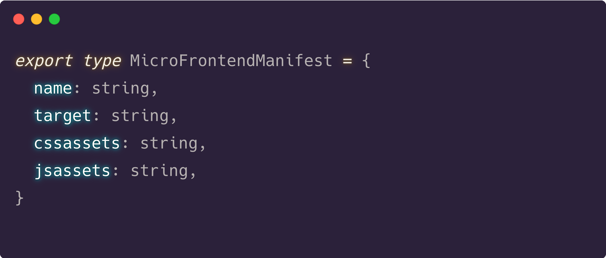

   

  

    Нам достаточно имени, таргета в хост приложении, где мы собираемся монтировать микро-фронтенд и пару урлов, откуда мы собираемся стянуть скрипты.
  

  

    Далее мы можем настроить нечто следующее:
  

  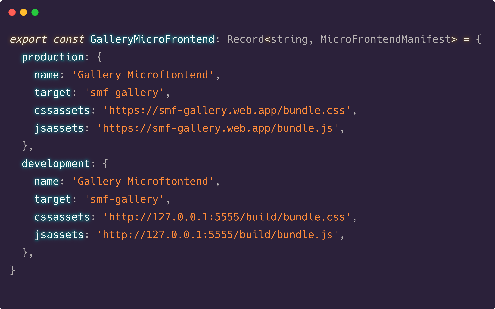

   

  

    Мы можем описать наши микро-фронтенды для нескольких сред, поскольку когда мы будем дебажить наше хост приложение, или просто прогонять тесты на CI нам могут быть не нужны скрипты с продакшена.
  

  

    После этого, мы можем создать мапу для всех микро-фронтендов и  положить ее где-нибудь на конфиг-сервере. Далее к ней будут иметь доступ все команды, которые могут независимо настраивать свои отдельные микро-фронтенды.
  

  

   

  

    Теперь, когда мы знаем всю информацию о местоположении микро-фронтенда, что нам нужно чтобы он заработал на странице?
  

  

    Во-первых мы должны убедиться, что сам микро-фронтенд осознает себя.
  

  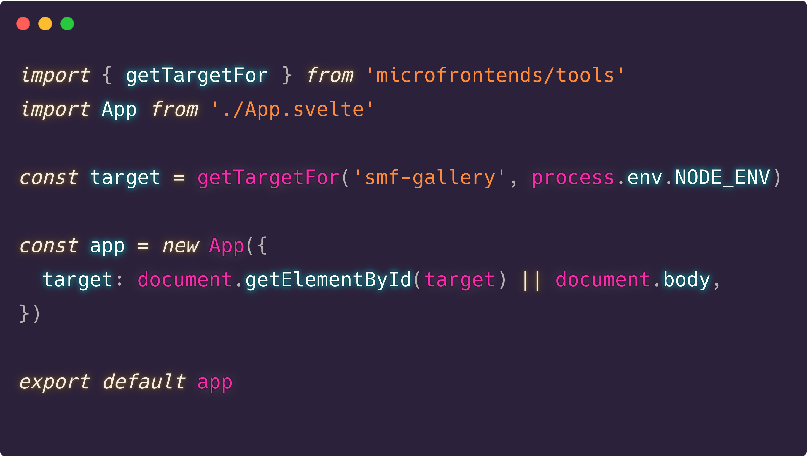

   

  

    Мы говорим, проверь текущий environment и возьми таргет для нашего микро-фронтенда. Потом мы его находим и передаем в приложение. Заметьте мы также оставили fallback для body, когда заявленного таргета нет на странице, так-как нам помимо общей интеграции нужно разрабатывать микро-фронтенд независимо от остальных. И если мы не находим таргет - это значит, что сейчас мы в локальном режиме.
  

  

    Во-вторых нам нужно убедиться, что в хост приложении есть место, в которое собирается встроиться микро-фронтенд.
  

  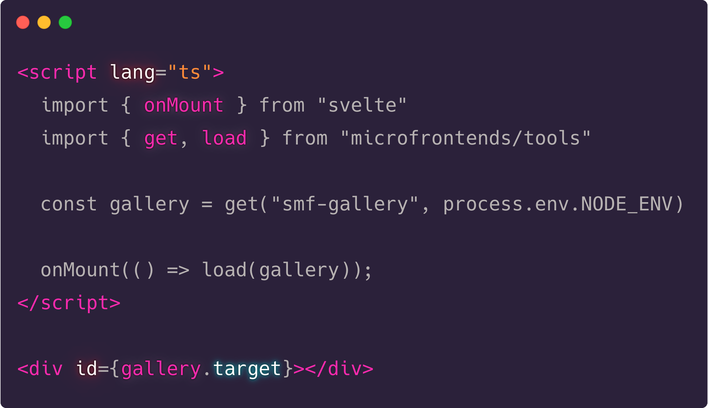

   

  

    Теперь когда обе стороны знают друг о друге, давайте посмотрим, что делает функция load.
  

  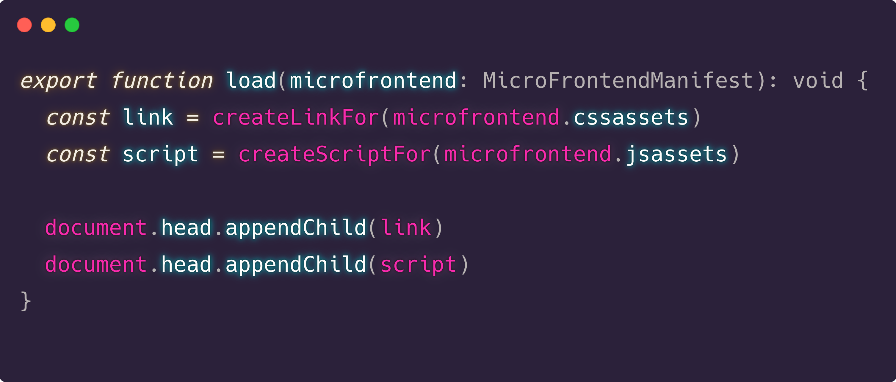

   

  

    Вот и все, единственное, что еще может понадобится - это проверить, что не добавили ли мы раньше наши скрипты и просто удалить их перед добавлением новых.
  

  

    Какие бенефиты мы можем получить используя такой подход? Я вижу три:
  

  1. Мы можем грузить наши скрипты и стили на какой-нибудь cdn. И если нам потребуется часто загружать их обратно, скрипты легко закешировать.
  2. Если расположить все скрипты на одном домене, не нужно будет решать проблему аутентификации/авторизации для разных микро-фронтендов. Достаточно оставить всю логику, относящуюся к авторизации, в хост приложении и остальные микро-фронтенды уже будут синхронизированы. Возможно потребуется какой-нибудь хак, когда мы будем локально писать микро-фронтенд, совсем изолированно ото всех, но здесь мы всегда можем замокать наш сервер.
  3. Мы можем пушить наши скрипты хоть по 10 раз в день в этот наш cdn, при этом никого мы трогать не будем, мы знаем где встраивается наше приложение, мы знаем какие скрипты ожидает хост.

  ................................

  

    Перейдем к следующему вопросу, как нам настроить коммуникации среди микро-фронтендов? Какие опции мы знаем?
  

  - события
  - бродкаст ченэл

  

    Но у этих двух подходов есть проблемы. События уж очень требуют внимания. Они асинхронные и могут быть раскиданы по самым неожиданным местам. Это делает их крайне сложными в тестировании.
  

  

    Что с бродкастом? Когда я говорил, что если у нас есть только js, то мы уже all set, я лукавил. Сейчас очень трудно представить разработку на js без какого-нибудь типизирующего инструмента. Собственно свелт поэтому и обзавелся поддержкой ts. И поскольку бродкаст ченел - это все-таки нативная реализация вы столкнетесь с некоторыми трудностями при типизации ваших данных, поскольку чтобы вы не передали в postMessage, это станет any. Поэтому я решил написать свой велосипед.
  

  

    В чем идея? Оставить подход как у бродкаст ченел с общей шиной сообщений, но типизировать события, которые могут передаваться по этой шине. То есть, если мы знаем, что микро-фронтенд Галерея должен общаться с хост приложением, то мы сами создаем все необходимые события для этого взаимодействия.
  

  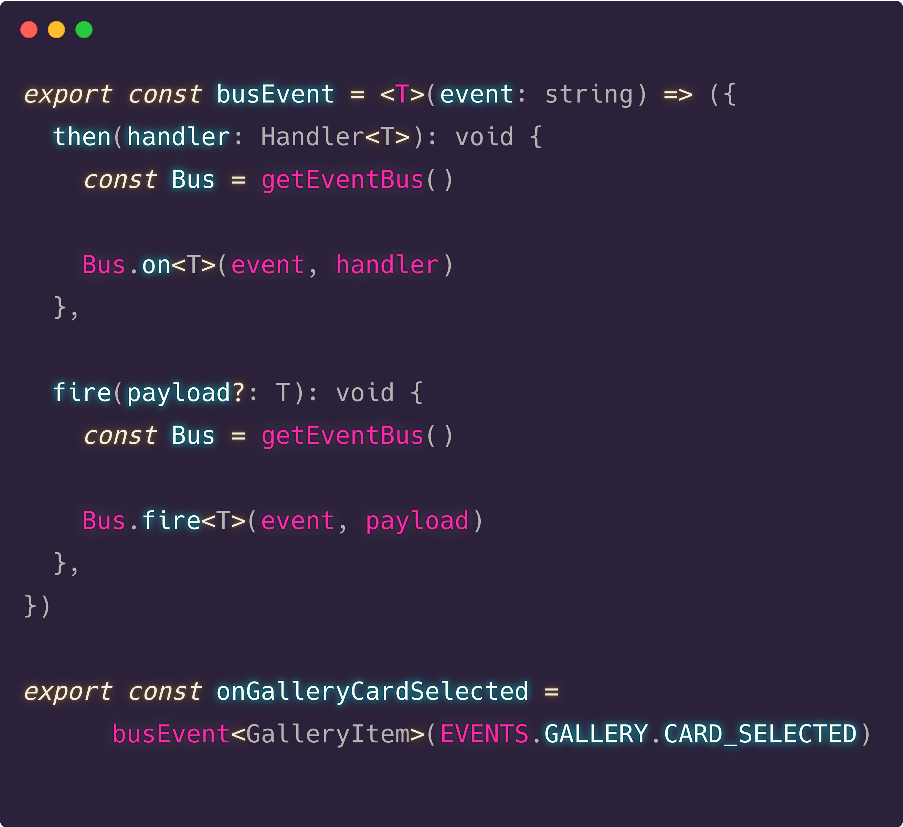

  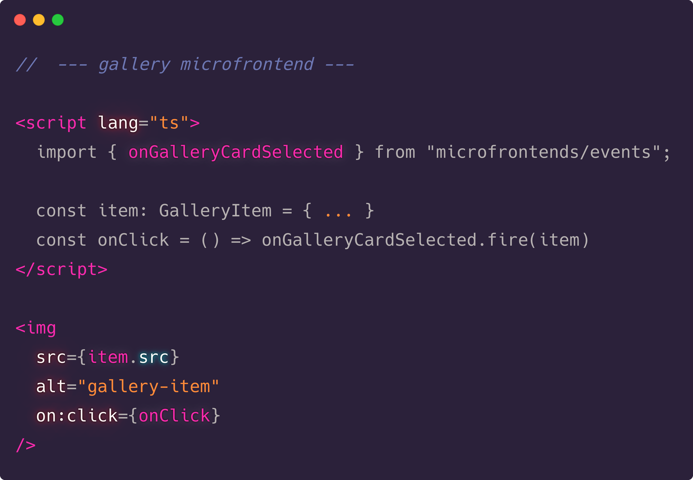

  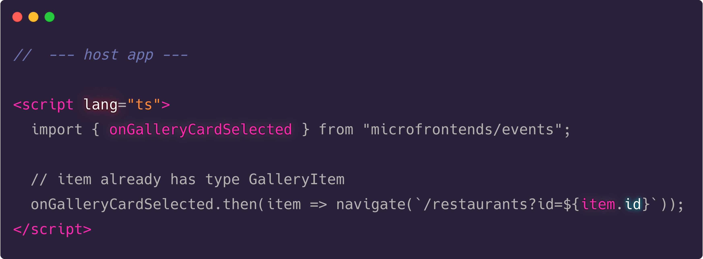

   

  

    Далее нам нужно посмотреть как выглядит сама шина сообщений.
  

  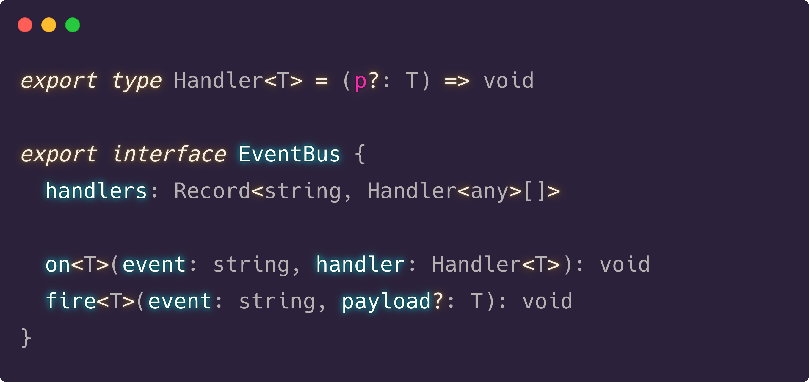

   

  

    И ее реализация:
  

  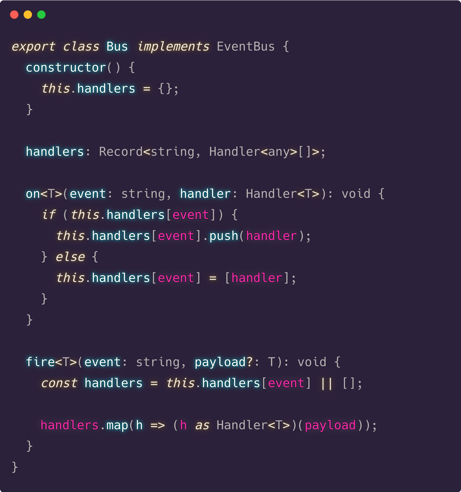

   

  

    То есть самая базовая реализация pub/sub паттерна. А для того чтобы сделать процесс подключения к этой шине более лаконичным, заведем также несколько хелперов.
  

  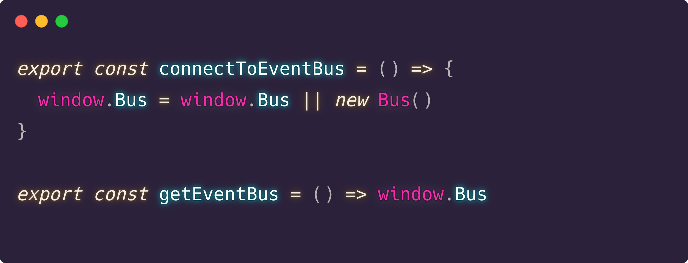

   

  

    Какие бенефиты я вижу в этом подходе:
  

  - Все наши сообщения типизированы;
  - Декларативный способ работы с шиной сообщений;
  - Удобство в тестировании. Как правило все общие ресурсы должны быть известны на старте разработки, в том числе названия всех событий и направления взаимодействия. Поэтому как только начинается локальная разработка, человеку, который занимается дебагом, не составляет труда просто из консоли браузера подключаться к шине событий и сгенерить нужное событие с нужными данными.

  

    В общем-то в остальном тестирование микро-фронтендов ничем не отличается от обычных приложений. Но есть один момент относительно интеграционного тестирования и тестов. Они не нужны. Но, наверно, вы уже догадались сами почему. Это межкомандные взаимодействия, что, мы уже знаем, не работает с микро-фронтендами. А также, даже если кто-то сам напишет эти тесты, кто их будет поддерживать в актуальном состоянии - большая загадка. Лучше использовать что-то вроде Consumer-Driven-Contracts когда каждый микро-фронтенд описывается как перечень того, что ему необходимо для корректной работы, а не в виде тестов в реальной среде. Это тема для отдельного доклада, а с выдержкой <a target="_blank" href="https://martinfowler.com/articles/consumerDrivenContracts.html">можно познакомится на martinfowler</a>.
  

  ................................

  

    Следующий вопрос, который мы рассмотрим - независимый деплой. На самом деле это пожалуй самый легкий вопрос, поскольку существует огромное кол-во площадок где можно просто положить свои скрипты. Тот же гитхаб и github pages, или heroku. Я выбрал firebase, у них даже есть такая опция - хостинг с небольшой аналитикой из коробки. Все что нам нужно, установить firebase tools, вызвать в терминале firebase init и проследовать инструкциям.
  

  

    И это все. Несколько незамысловатых действий и мы получаем наш фреймворк для микро-фронтендов. Осталось только убедить своего пиэма, что вам нужно все поменять в вашей компании. Потому что надо быть первыми, ну надо! <a target="_blank" href="https://github.com/vtcaregorodtcev/svelte-reactive-micro-frontends">Оставлю ссылочку</a> на исходники и работающие микро-фронтенды.
  

   

  # Заключение

  

    Итак, о чем это я тут рассказвал в трех частях
  

  - Если вы используете Фреймворк Х и вас все устраивает - это замечательно.
  - Микро-фронтенды позволяют решить некоторые организационные моменты в вашей работе. Вы можете фокусироваться на проблеме пользователя не отвлекаясь на коммуникации между разными командами.
  - Микро-фронтенды позволяют вам писать инкапсулированный код, который можно независимо от других деплоить в продакшен.
  - Инкапсуляция и независимость позволяет вам постоянно улучшать вашу кодовую базу.
  - Если вы хотите использовать ваш Фреймворк Х вместе с микро-фронтендами, скорей всего у вас не получится, ну или получаться свои микро-фронтенды в вакууме.
  - Фреймворки сложные и не подходят для отдельных микро-фронтендов, возможно только для хост приложений.
  - Ниша микро-фронтендов остается за компилируемыми фреймворками.

  

    Можно использовать несложные фреймворки - например преакт. Но у него нет своего пути развития. Это роль преследования, что делает такие фреймворки как свелт более приоритетными. Модульная сущность микро-фронтендов, реактивность взаимодействия делает свелт практически идеальным кандидатом.  Микро-фронтенды - это про компилируемые фреймворки и про свелт в частности.
  

   

  # Эпилог

  

    Что же, наш герой вынес замечательный урок. В погоне за прекрасным, подобно кружке Канемана, велик соблазн переоценивать то, что мы имеем и преуменьшать цену того что нам пытаются продать, но как сам Канеман и говорил - “Думай медленно”, позволь новой мысли просочиться сквозь тебя, и ты увидишь результат.
  

